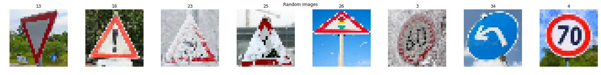
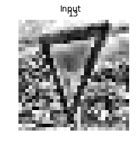
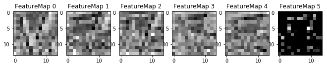

# **Traffic Sign Recognition** 

## Writeup Template

### You can use this file as a template for your writeup if you want to submit it as a markdown file, but feel free to use some other method and submit a pdf if you prefer.

---

**Build a Traffic Sign Recognition Project**

The goals / steps of this project are the following:
* Load the data set (see below for links to the project data set)
* Explore, summarize and visualize the data set
* Design, train and test a model architecture
* Use the model to make predictions on new images
* Analyze the softmax probabilities of the new images
* Summarize the results with a written report

[//]: # (Image References)

[image1]: ./examples/visualization.jpg "Visualization"
[image2]: ./examples/grayscale.jpg "Grayscaling"
[image3]: ./examples/random_noise.jpg "Random Noise"
[image4]: ./examples/placeholder.png "Traffic Sign 1"
[image5]: ./examples/placeholder.png "Traffic Sign 2"
[image6]: ./examples/placeholder.png "Traffic Sign 3"
[image7]: ./examples/placeholder.png "Traffic Sign 4"
[image8]: ./examples/placeholder.png "Traffic Sign 5"

## Rubric Points
### Here I will consider the [rubric points](https://review.udacity.com/#!/rubrics/481/view) individually and describe how I addressed each point in my implementation.  

---
### Writeup / README

#### 1. Provide a Writeup / README that includes all the rubric points and how you addressed each one. You can submit your writeup as markdown or pdf. You can use this template as a guide for writing the report. The submission includes the project code.

You're reading it! and here is a link to my [project code](./Traffic_Sign_Classifier.ipynb)

### Data Set Summary & Exploration

#### 1. Provide a basic summary of the data set. In the code, the analysis should be done using python, numpy and/or pandas methods rather than hardcoding results manually.

I used python and numpy library to calculate summary statistics of the traffic signs data set:

* The size of training set is 34799
* The size of the validation set is 4410
* The size of test set is 12630
* The shape of a traffic sign image is 32x32x3
* The number of unique classes/labels in the data set is 43

#### 2. Include an exploratory visualization of the dataset.

Here is an exploratory visualization of the data set. It is a bar chart showing how the data distribution of the training data. Each bar represents one class (traffic sign) and how many samples are in the class. The mapping of traffic sign names to class id can be found here: [signnames.csv](./signnames.csv)

### Design and Test a Model Architecture

#### 1. Describe how you preprocessed the image data. What techniques were chosen and why did you choose these techniques? Consider including images showing the output of each preprocessing technique. Pre-processing refers to techniques such as converting to grayscale, normalization, etc. (OPTIONAL: As described in the "Stand Out Suggestions" part of the rubric, if you generated additional data for training, describe why you decided to generate additional data, how you generated the data, and provide example images of the additional data. Then describe the characteristics of the augmented training set like number of images in the set, number of images for each class, etc.)

As a first step, I decided to convert the images to grayscale because of reducing the amount of input data, training the model is significantly faster. The color of traffic signs should not be important for classification, because they are designed that even color blind people can identify them.

Here is an example of a traffic sign image before and after grayscaling.

I normalized the data before training to make the training faster and reduce the chance of getting stuck in local optima.

I decided to generate additional data to increase samples for training, which in turn would make training more robust. The newly generated dataset includes normalized original data, and newly generated data (by randomly introducing rotation, x-translation, y-translation, sheer factor and zoom factor to the original data).to increase samples for training, which in turn would make training more robust. The newly generated dataset includes normalized original data, and newly generated data (by randomly introducing rotation, x-translation, y-translation, sheer factor and zoom factor to the original data). The new dataset is balanced and had already been pre-processed for normalizing contrast and illumination.

To add more data to the the data set, I used the following techniques because I wanted to be careful not to produce an unrecognizable images.

Here is an example of an original image and an augmented image:

The difference between the original data set and the augmented data set is augmented data randomly rotated, x/y translated, sheer factored and zoom factored.

#### 2. Describe what your final model architecture looks like including model type, layers, layer sizes, connectivity, etc.) Consider including a diagram and/or table describing the final model.

My final model consisted of the following layers:

| Layer         		|     Description	        					|
|:---------------------:|:---------------------------------------------:|
| Input         		| 32x32x1 grayscale image   				    |
| Convolution 5x5    	| 1x1 stride, valid padding, outputs 28x28x6 	|
| Relu					|												|
| Max pooling	      	| 2x2 stride, outputs 14x14x64  				|
| Convolution 5x5	    | 1x1 stride, valid padding, outputs 10x10x16   |
| Relu					|												|
| Max pooling	      	| 2x2 stride, outputs 5x5x16    				|
| Flatten				| 16 dimensions -> 1 dimension, outputs 400		|
| Fully connected		| Input 400, output 120             			|
| Relu					|												|
| droupout      		|   							                |
| Fully connected		| Input 120, output 84     						|
| Relu					|												|
| dropuout				|   									        |
| Fully connected		| Input 84, output 43     						|
| Softmax				|												|
|						|												|

#### 3. Describe how you trained your model. The discussion can include the type of optimizer, the batch size, number of epochs and any hyperparameters such as learning rate.

To train the model, I used an:
- AdamOptimizer for managing learning rate
- Batch Size: 128
- Epochs: 20
- Variables initialized with normal distribution (mean=0, std dev=0.1)
- Biases initialized with zeros

#### 4. Describe the approach taken for finding a solution and getting the validation set accuracy to be at least 0.93. Include in the discussion the results on the training, validation and test sets and where in the code these were calculated. Your approach may have been an iterative process, in which case, outline the steps you took to get to the final solution and why you chose those steps. Perhaps your solution involved an already well known implementation or architecture. In this case, discuss why you think the architecture is suitable for the current problem.

My final model results were:
* training set accuracy of 93.513% (Std: 5.762)
* validation set accuracy of 97.12% (Std: 4.281)
* test set accuracy of 94.443% (Std: 6.082)

If an iterative approach was chosen:
* What was the first architecture that was tried and why was it chosen?

LeNet-5 shown in the udacity classroom

* What were some problems with the initial architecture?

Validation accuracy of about 90%, but the test accuracy was much lower (about 80%)

* How was the architecture adjusted and why was it adjusted? Typical adjustments could include choosing a different model architecture, adding or taking away layers (pooling, dropout, convolution, etc), using an activation function or changing the activation function. One common justification for adjusting an architecture would be due to overfitting or underfitting. A high accuracy on the training set but low accuracy on the validation set indicates over fitting; a low accuracy on both sets indicates under fitting.

Added few dropouts to make a model more generic, generate additional data to increase samples for training and did more image preprocessing such as Histogram Equalization to reduce noise in images and thus make the model more robust in predicting same images

* Which parameters were tuned? How were they adjusted and why?

None

* What are some of the important design choices and why were they chosen? For example, why might a convolution layer work well with this problem? How might a dropout layer help with creating a successful model?

I started trying with an high dropout rate 50% and this seemed to slow down overfitting: the model was slower to 
train but also achieved a slightly higher accuracy in the end. 
However, only When added the augmented dataset I started seeing strong increased performance as the model 
was now able to learn within a few epochs but at the same time to generalize well on the validation set.

If a well known architecture was chosen:
* What architecture was chosen?

LeNet-5 with few dropouts shown in the udacity classroom

* Why did you believe it would be relevant to the traffic sign application?

Because traffic sign classifier works pretty well overall with the test set

* How does the final model's accuracy on the training, validation and test set provide evidence that the model is working well?

The network is producing better than 93% accuracy within 20 epochs on all 3 input sets
 

### Test a Model on New Images

#### 1. Choose five German traffic signs found on the web and provide them in the report. For each image, discuss what quality or qualities might be difficult to classify.

Here are five German traffic signs that I found on the web:

#### 2. Discuss the model's predictions on these new traffic signs and compare the results to predicting on the test set. At a minimum, discuss what the predictions were, the accuracy on these new predictions, and compare the accuracy to the accuracy on the test set (OPTIONAL: Discuss the results in more detail as described in the "Stand Out Suggestions" part of the rubric).

Here are the results of the prediction:

| Image			        |     Prediction	        					| 
|:---------------------:|:---------------------------------------------:| 
| Yield                 | Yield  		                				| 
| General caution       | General caution 	            				|
| Slippery road			| Slippery road									|
| Road work  		    | Bumpy road			 				        |
| Traffic signals	    | No vehicles 						            |
| Speed limit (60km/h)	| Speed limit (60km/h)   						|
| Turn left ahead	    | Turn left ahead   							|
| Speed limit (70km/h)	| Speed limit (70km/h) 							|

The model was able to correctly guess 6 of the 8 traffic signs, which gives an accuracy of 75%. This is lower than the test accuracy of 94%. Although model failed on the image class 25 because significant part of traffic sign is covered with snow the correct prediction is in top 5 list. The image class 26 is too skewed for the model to make a proper prediction.

#### 3. Describe how certain the model is when predicting on each of the five new images by looking at the softmax probabilities for each prediction. Provide the top 5 softmax probabilities for each image along with the sign type of each probability. (OPTIONAL: as described in the "Stand Out Suggestions" part of the rubric, visualizations can also be provided such as bar charts)

The code for making predictions on my final model is located in the 31st cell of the Ipython notebook.

The top five soft max probabilities were:

### (Optional) Visualizing the Neural Network (See Step 4 of the Ipython notebook for more details)
#### 1. Discuss the visual output of your trained network's feature maps. What characteristics did the neural network use to make classifications?

The code for visualizing the Neural Network is located in the 34th cell of the Ipython notebook.

Image input:

Untrained model feature map:

Tained model feature map:

On the first picture with untrained model we can see some noisy patterns, which can be an indicator of a network that hasn't been trained. On the second picture with trained model we can see nice and smooth patterns without any noise.
